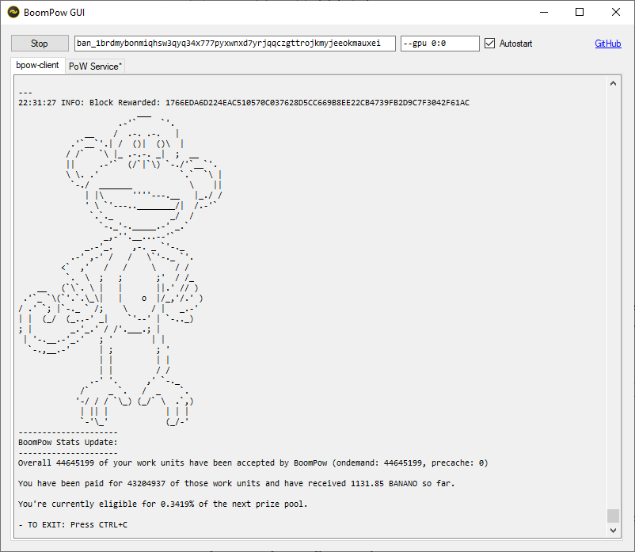

# BoomPow GUI

Simple C# GUI for [BoomPow](https://github.com/BananoCoin/boompow). This is completely standalone, no need to install python! It minimizes to the system tray and has an option to automatically start on login.

Donations: `ban_1brdmybonmiqhsw3qyq34x777pyxwnxd7yrjqqczgttrojkmyjeeokmauxei`

**[Download](https://github.com/mrexodia/BoomPowGui/releases/latest)**

## Installation

- Download and extract `BoomPowGui.zip`
- Open `BoomPowGui.exe`
- Modify the address to point to yours and optionally enable the Autostart option to start with Windows.

## Advanced configuration

You may need to change the `--gpu 0:0` option to `1:0` or `0:1` depending on system configuration.
If you are using multiple GPUs, you can specify multiple `--gpu` options, e.g. `--gpu 0:0 --gpu 1:0 --gpu 2:0`
If you are using CPU-only, you should remove the `--gpu 0:0` option and add `--cpu-threads X` where `X` is max number of threads
